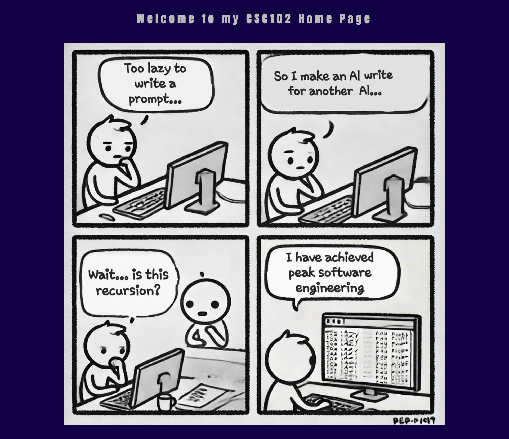

# CSC102-1.1

## Week 2.1: Using CSS

Created a `main.css` file to create a general style for the website. The CSS file is linked to the HTML files.

## Screenshots:

- Index.html:

- Boards.html:

